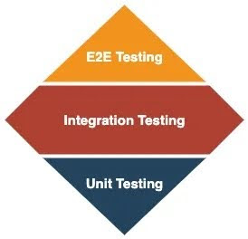

# Automated Testing Strategy

## Introduction & Strategic Goals

This document summarizes Digital’s automated testing strategy: integrating testing throughout development to improve software quality, speed delivery, and promote shared ownership between engineering and QA. It provides a consistent, efficient framework for all projects.

### Core Goals of Automation

1. **Speed and Confidence:** Increase release velocity by providing fast, reliable feedback on code changes.
2. **Coverage and Stability:** Maximize test coverage in critical, high-risk, and high-traffic user journeys.
3. **Cost Efficiency:** Significantly reduce the time spent on repetitive manual regression testing.
4. **Create A Culture Where Everyone Owns Quality:** Ensure accountability for test creation, maintenance, and failure debugging is shared across Engineering and QA.

## Automation Philosophy & Architecture

### The Test Automation Pyramid/Diamond Philosophy

_Figure: The Testing Pyramid_
Source: Martin Fowler, “Test Pyramid,” [MartinFowler.com](https://martinfowler.com/)

_Figure: The Testing Diamond_
Source: Ritesh Kapoor, “Testing Automation, What are Pyramids and Diamonds?,” [Ritesh-Kapoor.medium.com](https://ritesh-kapoor.medium.com/testing-automation-what-are-pyramids-and-diamonds-67494fec7c55)

Our Test Automation Philosophy and Architecture are built upon adapting established testing strategies to best suit the diverse needs of NYPL projects. While various models exist—including the Inverted Pyramid, [Pyramid](https://martinfowler.com/articles/practical-test-pyramid.html#TheTestPyramid), [Diamond](https://ritesh-kapoor.medium.com/testing-automation-what-are-pyramids-and-diamonds-67494fec7c55), [Trophy](https://kentcdodds.com/blog/the-testing-trophy-and-testing-classifications), and [Honeycomb](https://testomat.io/blog/testing-pyramid-role-in-modern-software-testing-strategies/)—our primary goal at NYPL is for most projects to align with either the Pyramid or Diamond approach. The choice between these two will depend on the specific project's context, tech stack, and risk profile. We emphasize a pragmatic approach, encouraging collaboration between QA and Engineering to determine the most effective strategy for each project, rather than rigidly adhering to a single model.

### Semantics of Test Classification

While Unit, Integration, and E2E tests provide a helpful framework, the goal is to build a reliable, fast test suite that catches critical issues early. Focus on the practical value of tests over strict classifications or getting bogged down by semantics.

### Technology Stack & Tools

- **E2E Testing:** Playwright
- **Unit Testing:** Jest with React Testing Library, Pytest
- **API/Integration Testing:** Pytest, Playwright API Testing
- **CI/CD Integration:** GitHub Actions

### Automation Environments

- **Local:** Standards for running tests during development
- **CI/PR:** Quick, focused test runs for pull requests
- **QA/Staging:** Comprehensive, full-suite regression runs post-deployment

## Roles, Responsibilities, and Test Type Definition

### Unit Tests (The Foundation)

- **Definition:** Tests focused on small, isolated pieces of code (functions, components, modules).
- **Scope:** Business logic, utility functions, component rendering (without network calls).
- **Ownership:** **Engineering Team.** Responsible for writing, maintaining, and fixing. QA Engineers can write unit tests especially if they are strategically moving E2E tests lower down in the stack, but they should do so with guidance from engineers.
- **Coverage Expectation:** 80% target. If you are working in a repo that has less than 80% unit test coverage, you don’t need to spend weeks writing unit tests to remediate the coverage. Instead, aim to increase the coverage in every PR you make, even if it’s just by 1%.

### API and Integration Tests (The Business Logic Layer)

- **Definition:** Tests that verify communication between services, database interactions, or the integrity of API endpoints, without involving the browser UI.
- **Other names for these tests:** Service tests
- **Scope:** Data transformations, authentication flows, core transaction services.
- **Examples:**
  - **Collections API Tests:** [https://github.com/NYPL/collections-api/tree/qa/tests/functional](https://github.com/NYPL/collections-api/tree/qa/tests/functional)
  - **Bib Pipeline Tests:** [https://github.com/NYPL/rc_pipeline_testing/actions](https://github.com/NYPL/rc_pipeline_testing/actions)
- **Ownership:** Shared between Engineering and QA Engineers.

### End-to-End (E2E) UI Tests (The User Journey)

- **Definition:** Tests that simulate a user path through the application's UI, often spanning multiple pages or systems.
- **Other names for these tests:** Acceptance tests
- **Scope:** Critical, high-impact user flows (e.g., searching the catalog, logging in, making a donation). **Must only cover the most essential paths.**
- **Ownership:** Shared between Engineering and QA Engineers. QA Engineers are responsible for creation and primary maintenance; Engineering provides support for debugging infrastructure or complex failures.

### Specialized Testing Types

- **Accessibility Testing:** \[TBD – will need to work this out with Clare; some teams use jest-axe but this isn’t consistent across all of our apps\]
- **Visual Regression:** \[TBD – some teams use jest snapshot testing but this isn’t consistent across all of our apps\]
- **Security Testing:** \[TBD – will need to work this out with DevOps\]
- **Performance/Load Testing:** [QA Performance Test Plan](https://docs.google.com/document/d/1jhk2kd-mseCAa2_C-HApVnO6PdTVwj0jBLAd03n37SY/edit?usp=sharing)

## Execution, Maintenance, and Reporting

### CI/CD Pipeline Integration

- **Pull Request (PR) Execution:** Only run Unit and a small, critical subset of Integration/API tests. **Hard limit of 15 minutes max runtime.**
- **Deployment to QA/Staging:** Run the entire comprehensive E2E and Integration suite.

#### Handling PR E2E Test Runtime Limitations

As projects mature and E2E test suites grow, it's common to encounter the 15-minute PR runtime limit. When this occurs, QA Engineers should take the following steps:

1. **Identify Duplication and Migration Opportunities:**
   - Review existing E2E Playwright tests and unit tests to identify any overlap or tests that could be more effectively covered at a lower level of the testing pyramid (i.e., migrated from E2E to unit tests).
   - QA Engineers are encouraged to learn and contribute to writing unit tests, fostering a deeper understanding of the codebase and shared ownership of quality. Engineering teams will provide review and mentorship for these contributions.
2. **Re-evaluate E2E Test Runtimes:**
   - After addressing duplication and migrating tests, re-assess the runtime of the remaining E2E Playwright tests.
3. **Collaborate on Test Prioritization for PRs:**
   - If E2E tests still exceed the 15-minute limit, QA Engineers should collaborate with the Engineering team to determine which critical E2E tests must run on every PR and which can be deferred to run only after deployment to QA/Staging environments.
   - The QA Engineer is responsible for creating tickets and implementing the necessary changes to split the test suite and ensure reliable execution in the appropriate environments.

### Handling Flakiness and Failures

- **"Flaky Test Zero" Rule:** Flaky tests should be fixed or removed immediately. A test that fails inconsistently is a high-priority bug in itself.
- **Debugging Ownership:** All engineers and QA Engineers must be able to debug and fix failures in the CI/CD pipeline. No single QA engineer can be the bottleneck.

### Reporting and Metrics

Currently, in FY26, our main focus is writing automated tests. We are not focused on tracking metrics this year. In FY27, we plan to establish clear goals and guidelines for testing metrics, and the team will decide on the most suitable reporting tools to use.

Potential metrics to track in FY27:

- Test Execution Time (Overall & per suite)
- Flakiness Rate (Pass/Fail consistency)
- Total Test Count
- Code Coverage (where applicable)
