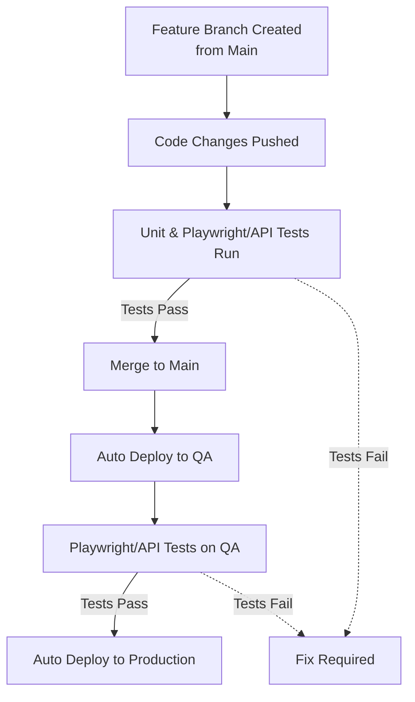

# Continuous Delivery

_This page defines Continuous Delivery and outlines the principles and foundations for modern CI/CD, adapted from "Accelerate: The Science of Lean Software and DevOps: Building and Scaling High Performing Technology Organizations" by Nicole Forsgren PhD, Jez Humble, and Gene Kim_

## What is Continuous Delivery?

Continuous delivery is a set of capabilities that enable us to get changes of all kinds—features, configuration changes, bug fixes, experiments—into production or into the hands of users safely, quickly, and sustainably. There are five key principles at the heart of continuous delivery:

- **Build quality in.** The third of W. Edwards Deming's fourteen points for management states, "Cease dependence on inspection to achieve quality. Eliminate the need for inspection on a mass basis by building quality into the product in the first place" (Deming 2000). In continuous delivery, we invest in building a culture supported by tools and people where we can detect any issues quickly, so that they can be fixed straight away when they are cheap to detect and resolve.
- **Work in small batches.** Organizations tend to plan work in big chunks—whether building new products or services or investing in organizational change. By splitting work up into much smaller chunks that deliver measurable business outcomes quickly for a small part of our target market, we get essential feedback on the work we are doing so that we can course correct. Even though working in small chunks adds some overhead, it reaps enormous rewards by allowing us to avoid work that delivers zero or negative value for our organizations. A key goal of continuous delivery is changing the economics of the software delivery process so the cost of pushing out individual changes is very low.
- **Computers perform repetitive tasks; people solve problems.** One important strategy to reduce the cost of pushing out changes is to take repetitive work that takes a long time, such as regression testing and software deployments, and invest in simplifying and automating this work. Thus, we free up people for higher-value problem-solving work, such as improving the design of our systems and processes in response to feedback.
- **Relentlessly pursue continuous improvement.** The most important characteristic of high-performing teams is that they are never satisfied: they always strive to get better. High performers make improvement part of everybody's daily work.
- **Everyone is responsible.** As we learned from Ron Westrum, in bureaucratic organizations teams tend to focus on departmental goals rather than organizational goals. Thus, development focuses on throughput, testing on quality, and operations on stability. However, in reality these are all system-level outcomes, and they can only be achieved by close collaboration between everyone involved in the software delivery process. A key objective for management is making the state of these system-level outcomes transparent, working with the rest of the organization to set measurable, achievable, time-bound goals for these outcomes, and then helping their teams work toward them.

## Foundations for Continuous Delivery

In order to implement continuous delivery, we must create the following foundations:

- **Comprehensive configuration management.** It should be possible to provision our environments and build, test, and deploy our software in a fully automated fashion purely from information stored in version control. Any change to environments or the software that runs on them should be applied using an automated process from version control. This still leaves room for manual approvals—but once approved, all changes should be applied automatically.
- **Continuous integration (CI).** Many software development teams are used to developing features on branches for days or even weeks. Integrating all these branches requires significant time and rework. Following our principle of working in small batches and building quality in, high-performing teams keep branches short-lived (less than one day's work) and integrate them into trunk/master frequently. Each change triggers a build process that includes running unit tests. If any part of this process fails, developers fix it immediately.
- **Continuous testing.** Testing is not something that we should only start once a feature or a release is "dev complete." Because testing is so essential, we should be doing it all the time as an integral part of the development process. Automated unit and acceptance tests should be run against every commit to version control to give developers fast feedback on their changes. Developers should be able to run automated tests on their workstations in order to triage and fix defects. Testers should be performing exploratory testing continuously against the latest builds to come out of CI. No one should be saying they are "done" with any work until all relevant automated tests have been written and are passing.

---

## Example: Automated Continuous Delivery Workflow (NYPL Scholarly eBooks)

Below is a typical workflow for fully automated continuous delivery, as implemented for NYPL Scholarly eBooks:



**Workflow Steps:**

1. Developers create a feature branch from `main` and push code changes.
2. Automated unit tests and Playwright (frontend) or API integration (backend) tests run on every push.
3. If tests pass, code can be merged into `main`.
4. Merging to `main` triggers an automatic deployment to the QA environment.
5. Playwright or API tests run against the QA deployment.
6. If QA tests pass, the site is automatically deployed to Production.
7. If any tests fail, the process stops and requires a fix before proceeding.

This workflow ensures that only code which passes all automated checks is deployed, reducing manual intervention and increasing reliability.

---

## One-Branch Strategy

This modern continuous delivery workflow removes the need to keep track of multiple persistent branches such as `qa` and `production`. Instead, all deployments are automated and triggered directly from the `main` branch after successful testing. This is a key difference from the multi-branch flows described in [git-workflow.md](./git-workflow.md), which rely on separate branches for QA and production environments.

### Benefits of the One-Branch Strategy

- **Simplicity:** Reduces complexity by eliminating the need to manage and synchronize multiple persistent branches. No more backmerging.
- **Faster Feedback:** Automated tests and deployments provide rapid feedback, enabling teams to catch and fix issues quickly.
- **Reduced Manual Intervention:** Automation ensures that deployments are consistent and reliable, minimizing human error.
- **Improved Collaboration:** With everyone working from the same branch, teams stay in sync and avoid merge conflicts between long-lived branches.
- **Accelerated Delivery:** Code that passes all checks can reach production faster, supporting a true continuous delivery pipeline.

## Decoupling Deployment and Release

To ensure that half-finished features are not released to production unintentionally, it's important to decouple the technical act of deployment from the business decision to launch a feature. This allows teams to deploy code continuously while controlling when new features are actually made available to users.

**Key Patterns:**

- **Blue-Green Deployment:** Maintain two production environments ("blue" and "green"). Deploy new versions to the inactive environment, then switch traffic over with minimal downtime. This enables fast rollback and sub-second cutover, even for lengthy deployments.
- **Dark Launching:** Deploy new features to production but keep them hidden from users until they are ready to be released. This allows for testing in the production environment without exposing unfinished work.
- **Feature Flags (Feature Toggles):** Use configuration to enable or disable features at runtime. This is a common pattern at NYPL and allows teams to merge and deploy incomplete features safely, only releasing them to users when ready. Here's an example on Scholarly eBooks, where we use a

By using these patterns, you can safely deploy code to production at any time, while retaining full control over when features are actually released to your users.

### Example Git Workflow with Feature Flags

```mermaid
flowchart TD
    A[Feature Branch Created<br>from Main] --> B[Develop Feature with Flag]
    B --> C[Open PR to Main]
    C --> D[Automated Tests Run]
    D -->|Tests Pass| E[Merge to Main]
    E --> F[Auto Deploy to Production]
    F --> G[Feature Flag OFF<br>(Feature Hidden)]
    G --> H[Enable Feature Flag<br>for Release]
    H --> I[Feature Visible to Users]
    D -.->|Tests Fail| J[Fix Required]
```

**Diagram Explanation:**

- Developers create a feature branch from `main` and implement a new feature behind a feature flag.
- After automated tests pass, the code is merged into `main` and deployed to production, but the feature remains hidden (flag OFF).
- When ready, the feature flag is enabled, making the feature visible to users without a new deployment.

> **Note:**
> The diagram above illustrates an ideal runtime-configurable feature flag, where enabling a feature for users does not require a new deployment. However, in practice, some feature flags (such as those [currently used](https://github.com/NYPL/digital-research-books/pull/812/files#diff-b9585cc9e0753ad3a0d29ed97ba27bafbfeb14545d0bb6eedb0c3e5a6536c14a) in Scholarly eBooks) are controlled by environment variables or code changes. In these cases, enabling a feature for production does require a new deployment. For true runtime toggling, consider using a feature flag service or configuration that can be updated without redeploying your application.
