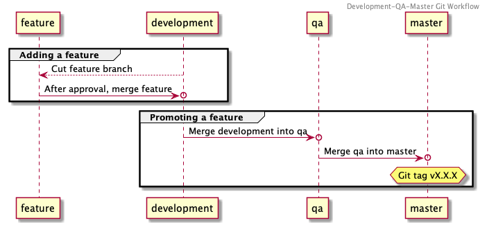
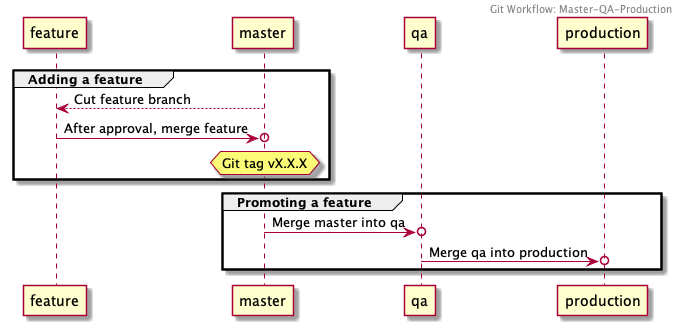
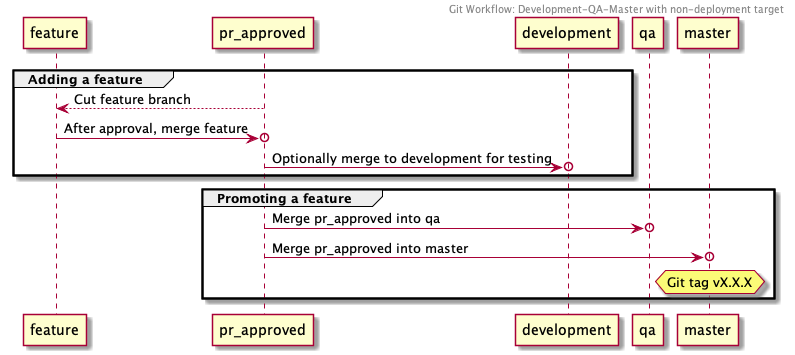

# Git workflow

All components MUST identify their "Git workflow" (aka "Merge strategy", "Steps for promoting a feature") in their README. A Git workflow identifies:

 * the persistent branches (e.g. "development", "qa", "master"), including what environment they are deployed to
 * which branch one must use for feature branches
 * whether and how one bumps the component version (if it deviates from [./versioning.md#typical-workflow](the standard)).
 * any deviations from [https://github.com/NYPL/engineering-general/blob/updating-header/standards/travis-ci.md](our typical CI/CD configuration)

## Common worklows

The following are common Git workflows, named here so they can be easily referenced by the components that use them.

### Development-QA-Master

| Branch        | Environment | Cut features from this branch | Version tag this branch |
|---------------|-------------|-------------------------------|-------------------------|
| `development` | Development | ✅                            |                         |
| `qa`          | QA          |                               |                         |
| `master`      | Production  |                               | ✅                      |

1. Create feature branch off `development`
1. Compute next logical version and update `README.md`, `CHANGELOG.md`, `package.json`, etc.
1. Create PR against `development`
1. After review, merge `development` > `qa`
1. After QC signoff, merge `qa` > `master`
1. Git tag `master` with new version number.

Example components:
 * https://github.com/NYPL/dgx-blogs
 * https://github.com/NYPL/dgx-homepage
 * https://github.com/NYPL/nypl-dgx-react-header
 * https://github.com/NYPL-discovery/discovery-front-end
 * https://github.com/NYPL/dgx-booklists
 * https://github.com/NYPL/staff-picks
 * https://github.com/NYPL/dgx-new-arrivals

### Master-QA-Production

This differs from (#development-qa-master)(Development-QA-Master) in 1) what it considers "Development" and "Production" branches and 2) where the version tag is applied.

| Branch        | Environment | Cut features from this branch | Version tag this branch |
|---------------|-------------|-------------------------------|-------------------------|
| `master`      | Development | ✅                            | ✅                      |
| `qa`          | QA          |                               |                         |
| `production`  | Production  |                               |                         |

1. Create feature branch off `master`
1. Compute next logical version and update `README.md`, `CHANGELOG.md`, `package.json`, etc.
1. Create PR against `master`
1. After merging the PR, git tag `master` with new version number.
1. Merge `master` > `qa`
1. After QC signoff, merge `qa` > `production`

Example components:
 * https://github.com/NYPL/nypl-library-card-app

### Development-Master

This is a simplified form of (#development-qa-master)(Development-QA-Master), which simply removes the `qa` branch.

| Branch        | Environment | Cut features from this branch | Version tag this branch |
|---------------|-------------|-------------------------------|-------------------------|
| `development` | Development | ✅                            |                         |
| `master`      | Production  |                               | ✅                      |

1. Create feature branch off `development`
1. Compute next logical version and update `README.md`, `CHANGELOG.md`, `package.json`, etc.
1. Create PR against `development`
1. After QC signoff, merge `qa` > `master`
1. Git tag `master` with new version number.

Example components:
 * https://github.com/NYPL/dgx-header-component#contributing-is-fun-and-easy (Note this app requests that the `devlopment` > `master` merge be carried out via PR)

### Development-QA-Master with non-deployment target

This is a variation on (#development-qa-master) that specifies a single extra branch situated immediately before `development`, which is not deployed.

For example:

| Branch        | Environment | Cut features from this branch | Version tag this branch |
|---------------|-------------|-------------------------------|-------------------------|
| `pr_approved` | n/a         | ✅                            |                         |
| `development` | Development |                               |                         |
| `qa`          | QA          |                               |                         |
| `master`      | Production  |                               | ✅                      |

1. Create feature branch off `pr_approved`
1. Compute next logical version and update `README.md`, `CHANGELOG.md`, `package.json`, etc.
1. Create PR against `pr_approved`
1. Pre-review, deploy to `development` by merging `pr_approved` > `development`
1. After review, merge `pr_approved` > `qa`
1. After QC signoff, merge `pr_approved` > `master`
1. Git tag `master` with new version number.

Example components:
 * https://github.com/NYPL/dgx-global-search (uses "pr_approved" as non-deployment PR target)
