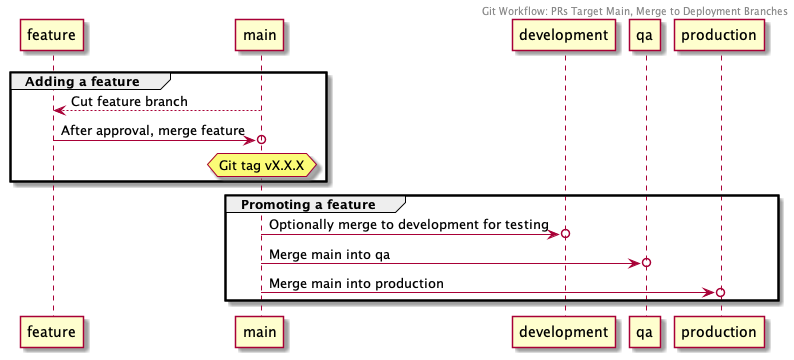

# Git workflow

All repos MUST identify their "Git workflow" (aka "Merge strategy", "Steps for promoting a feature") in their README. A Git workflow identifies:

 * the persistent branches (e.g. "development", "qa", "master"/"main"\*), including what environment they are deployed to if any
 * what branch to cut feature branches from
 * whether and how one bumps the component version (if it deviates from [the standard](./versioning.md#typical-workflow))
 * any deviations from [our typical CI/CD configuration](/standards/travis-ci.md)

Repos SHOULD link to the relevant Git workflow in this document and need not say anything more about the procedure if this document adequately describes it.

For example:

```
## Contributing

This repo uses the [Development-QA-Main Git Workflow](https://github.com/NYPL/engineering-general/blob/master/standards/git-workflow.md#development-qa-main)
```

## A note on master/main

New repos MUST use "main" over "master". The workflows described in this document favor the term "main" over "master" anticipiting that all NYPL repos will eventually make that shift.

## Common worklows

The following are common Git workflows, named here so they can be easily referenced by the components that use them.

### Development-QA-Main
<a id="development-qa-master"></a>


| Branch        | Environment | Cut features from this branch | Version tag this branch |
|---------------|-------------|-------------------------------|-------------------------|
| `development` | Development | ✅                            |                         |
| `qa`          | QA          |                               |                         |
| `main`        | Production  |                               | ✅                      |

1. Create feature branch off `development`
1. Compute next logical version and update `README.md`, `CHANGELOG.md`, `package.json`, etc.
1. Create PR against `development`
1. After review, merge `development` > `qa`
1. After QC signoff, merge `qa` > `main`
1. Git tag `main` with new version number.

Example components:
 * https://github.com/NYPL/dgx-homepage
 * https://github.com/NYPL/nypl-dgx-react-header
 * https://github.com/NYPL-discovery/discovery-front-end
 * https://github.com/NYPL/dgx-booklists
 * https://github.com/NYPL/dgx-new-arrivals
 * https://github.com/NYPL-discovery/sierra-retriever
 * https://github.com/NYPL/MyLibraryNYCApp (No version tagging)
 * https://github.com/NYPL/item-checkout-feed-updater
 * https://github.com/NYPL/recap-hold-request-service
 * https://github.com/NYPL/hold-request-result-consumer (No version tagging)
 * https://github.com/NYPL/nypl-hold-request-consumer (No version tagging)
 * https://github.com/NYPL/hold-request-service (No meaningful version tagging)
 * https://github.com/NYPL/job-service (No version tagging)
 * https://github.com/NYPL/sync-item-metadata-to-scsb-listener (No version tagging)
 * https://github.com/NYPL/checkin-request-service (No version tagging)
 * https://github.com/NYPL/checkout-request-service (No version tagging)
 * https://github.com/NYPL/cancel-request-consumer (No version tagging)
 * https://github.com/NYPL/proxy-request-service (No version tagging)
 * https://github.com/NYPL/docsservice (No version tagging)

### Main-QA-Production
<a id="master-qa-production"></a>


This differs from [Development-QA-Main](#development-qa-main) in 1) what it considers "Development" and "Production" branches and 2) where the version tag is applied.

| Branch        | Environment | Cut features from this branch | Version tag this branch |
|---------------|-------------|-------------------------------|-------------------------|
| `main`        | Development | ✅                            | ✅                      |
| `qa`          | QA          |                               |                         |
| `production`  | Production  |                               |                         |

1. Create feature branch off `main`
1. Compute next logical version and update `README.md`, `CHANGELOG.md`, `package.json`, etc.
1. Create PR against `main`
1. After merging the PR, git tag `main` with new version number.
1. Merge `main` > `qa`
1. After QC signoff, merge `qa` > `production`

Example components:
 * https://github.com/NYPL/nypl-library-card-app
 * https://github.com/NYPL/digitalreadingroom (No version tagging)
 * https://github.com/NYPL/repository-api
 * https://github.com/NYPL/mms
 * https://github.com/NYPL/media-ingest-json-bag-parser (This app prefers branch names `main > development > production`, but otherwise appears the same. Also, no versioning.)
 * https://github.com/NYPL/fedora_ingest_rails (No version tagging)
 * https://github.com/NYPL/item-feed-viewer

### Development-Main
<a id="development-master"></a>

This is a simplified form of [Development-QA-Main](#development-qa-main), which simply removes the `qa` branch.

| Branch        | Environment | Cut features from this branch | Version tag this branch |
|---------------|-------------|-------------------------------|-------------------------|
| `development` | Development | ✅                            |                         |
| `main`        | Production  |                               | ✅                      |

1. Create feature branch off `development`
1. Compute next logical version and update `README.md`, `CHANGELOG.md`, `package.json`, etc.
1. Create PR against `development`
1. After QC signoff, merge `development` > `main`
1. Git tag `main` with new version number.

Example components:
 * https://github.com/NYPL/dgx-header-component#contributing-is-fun-and-easy (Note this app requests that the `devlopment` > `main` merge be carried out via PR)

### Development-QA-Main with non-deployment target
<a id="development-qa-master-with-non-deployment-target"></a>

Rename: Non-deployment Target Merged to Development, QA, Main


This is a variation on (Development-QA-Main)[#development-qa-main] that specifies a single extra branch situated immediately before `development`, which is not deployed.

For example:

| Branch        | Environment | Cut features from this branch | Version tag this branch |
|---------------|-------------|-------------------------------|-------------------------|
| `pr_approved` | n/a         | ✅                            |                         |
| `development` | Development |                               |                         |
| `qa`          | QA          |                               |                         |
| `main`        | Production  |                               | ✅                      |

1. Create feature branch off `pr_approved`
1. Compute next logical version and update `README.md`, `CHANGELOG.md`, `package.json`, etc.
1. Create PR against `pr_approved`
1. Pre-review, deploy to `development` by merging `pr_approved` > `development`
1. After review, merge `pr_approved` > `qa`
1. After QC signoff, merge `pr_approved` > `main`
1. Git tag `main` with new version number.

Example components:
 * https://github.com/NYPL/dgx-global-search (uses "pr_approved" as non-deployment PR target)

### PRs Target Main, Merge to Deployment Branches
<a id="prs-target-master-merge-to-deployment-branches"></a>

This may be a cleaner form of above in that the PR target branch is not also a deployment branch.



| Branch        | Environment | Cut features from this branch | Version tag this branch |
|---------------|-------------|-------------------------------|-------------------------|
| `main`        | n/a         | ✅                            | ✅                       |
| `development` | Development |                               |                         |
| `qa`          | QA          |                               |                         |
| `production`  | Production  |                               |                         |

1. Create feature branch off `main`
1. Compute next logical version and update `README.md`, `CHANGELOG.md`, `package.json`, etc. (Note this may be done *after* PR approval & merge if there are mult. features in play.)
1. Create PR against `main`
1. After approval merge PR into `main`
1. Git tag `main` with new version number.
1. Optionally deploy to `development` by merging `main` > `development`
1. Deploy to `qa` by merging `main` > `qa`
1. After QC signoff (if applicable), merge `main` > `production`

Example components:
 * https://github.com/NYPL-discovery/discovery-store-poster
 * https://github.com/NYPL-discovery/discovery-api (Note the README says version tags should apply to `production`, but versions have rarely been applied:.)


### Main-Development-QA-Production
<a id="master-development-qa-production"></a>

This is essentially [Development-QA-Production](#development-qa-production) but using `main` as non-deploy PR target.


| Branch        | Environment | Cut features from this branch | Version tag this branch |
|---------------|-------------|-------------------------------|-------------------------|
| `main`        | n/a         | ✅                            | ✅                       |
| `development` | Development |                               |                         |
| `qa`          | QA          |                               |                         |
| `production`  | Production  |                               |                         |

1. Create feature branch off `main`
1. Compute next logical version and update `README.md`, `CHANGELOG.md`, `package.json`, etc.)
1. Create PR against `main`
1. After approval merge PR into `main`
1. Git tag `main` with new version number.
1. Merge `main` > `development`
1. Deploy to `qa` by merging `main` > `qa`
1. After QC signoff (if applicable), merge `main` > `production`

Example components:
 * https://github.com/NYPL/data.archives
