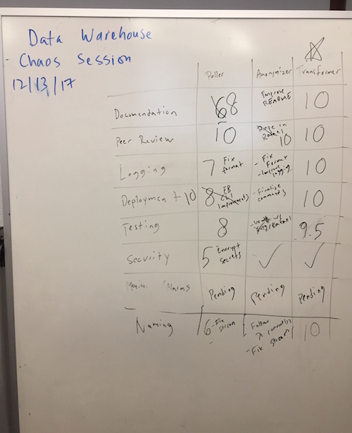

# Production Readiness

Before launching a new service or application to production, it SHOULD be reviewed by the team to ensure production readiness and adherence with engineering standards.

Not all categories may be applicable for certain services or applications (e.g. Accessibility for a back-end service).

A pre-launch checklist SHOULD be completed and can be completed in a pre-launch team meeting:

## Sample Pre-Launch Checklist

| Category                                                                                                                                                                                                                                                   | Completeness (1-10) |
|------------------------------------------------------------------------------------------------------------------------------------------------------------------------------------------------------------------------------------------------------------|---------------------|
| Documentation [1](https://github.com/NYPL/engineering-general/blob/master/standards/documentation.md)                                                                                                                                                      |                     |
| Peer Review [1](https://github.com/NYPL/engineering-general/blob/master/standards/peer-review.md)                                                                                                                                                          |                     |
| Logging [1](https://github.com/NYPL/engineering-general/blob/master/standards/logging.md)                                                                                                                                                                  |                     |
| Deployment [1](https://github.com/NYPL/engineering-general/blob/master/standards/node-lambda.md)                                                                                                                                                           |                     |
| Coding Standards [1](https://github.com/NYPL/engineering-general/blob/master/standards/coding-standards.md), [2](https://github.com/NYPL/engineering-general/blob/master/standards/naming-conventions.md)                                                  |                     |
| Testing [1](https://github.com/NYPL/engineering-general/blob/master/standards/test-coverage.md)                                                                                                                                                            |                     |
| Accessibility [1](https://github.com/NYPL/engineering-general/blob/master/standards/accessibility.md)                                                                                                                                                      |                     |
| Security [1](https://github.com/NYPL/engineering-general/blob/master/security/README.md), [2](https://github.com/NYPL/engineering-general/blob/master/security/oauth.md), [3](https://github.com/NYPL/engineering-general/blob/master/security/secrets.md) |                     |
| Monitoring & Alarms [1](https://github.com/NYPL/engineering-general/blob/master/standards/alerting.md)                                                                                                                                                     |                     |
